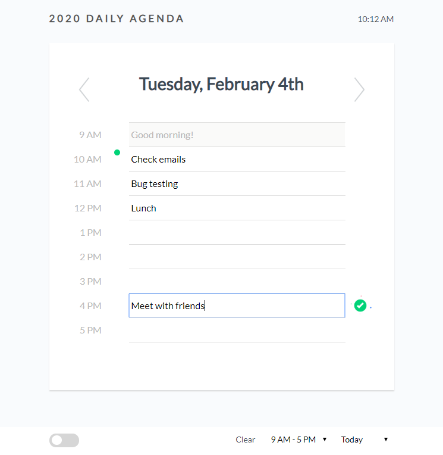

# Day Planner
Day planner that lets you set an hourly agenda for the work day.

* Indicates the current hour
* Past hours are grayed out
* Uses localStorage to save input field data
* Input fields save as you modify text
* Navigate between dates
* Displays work hours, but it can easily change to 24 hours
* Clear stored data

https://yankidank.github.io/daily-agenda/

Uses [jQuery 3.4.1](https://code.jquery.com/)
