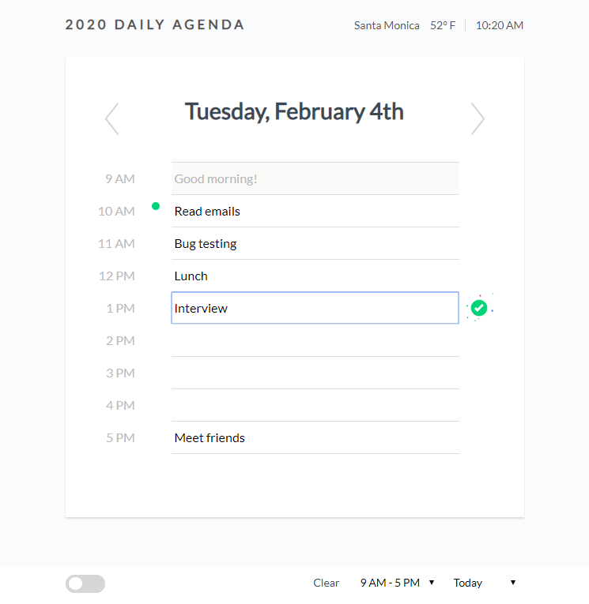
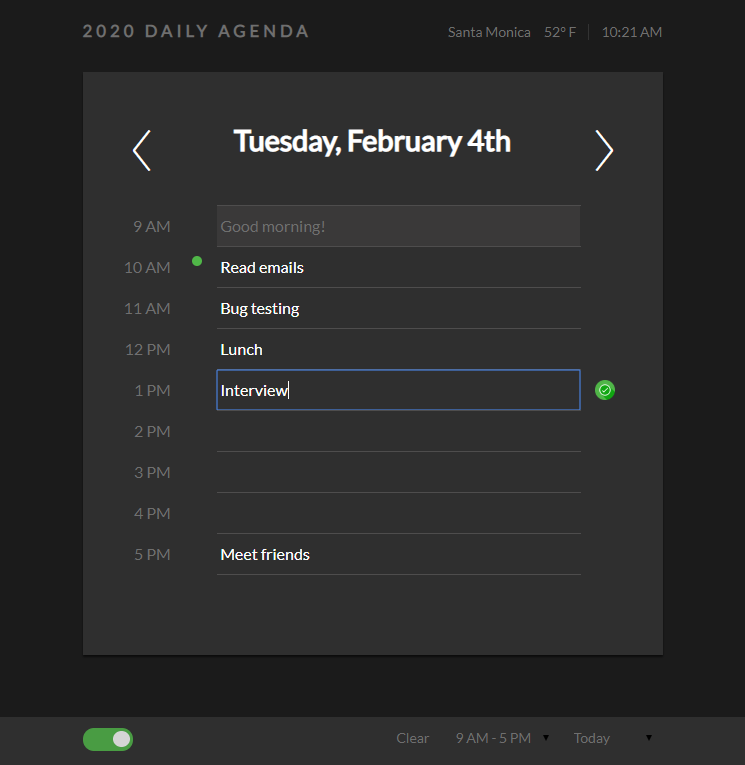
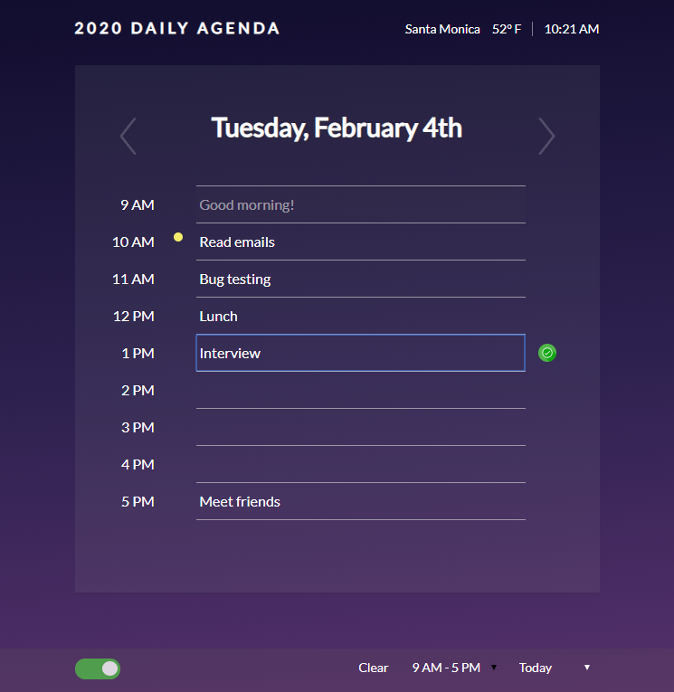

# Day Planner
Day planner that lets you set an hourly agenda for the work day.

* An indicator icon tracks the current time along the hour rows
* Past hours are grayed out
* Uses localStorage to save input field data
* Input fields save as you modify text
* Navigate between different dates
* Change between work hours and 24 hour view
* Dark mode and "Golden" hour view modes. Golden displays around sunrise and sunset
* When able (not on GitHub) displays the local city and temperature in the navbar
* Clear stored calendar data

[GitHub Demo](https://yankidank.github.io/daily-agenda/) | [Golden Hour](https://yankidank.github.io/daily-agenda/?mode=golden)

Uses [jQuery 3.4.1](https://code.jquery.com/) and [Moment.js](http://momentjs.com/)
